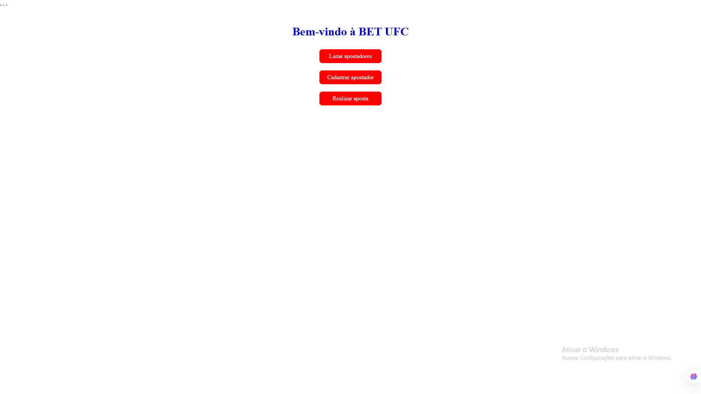
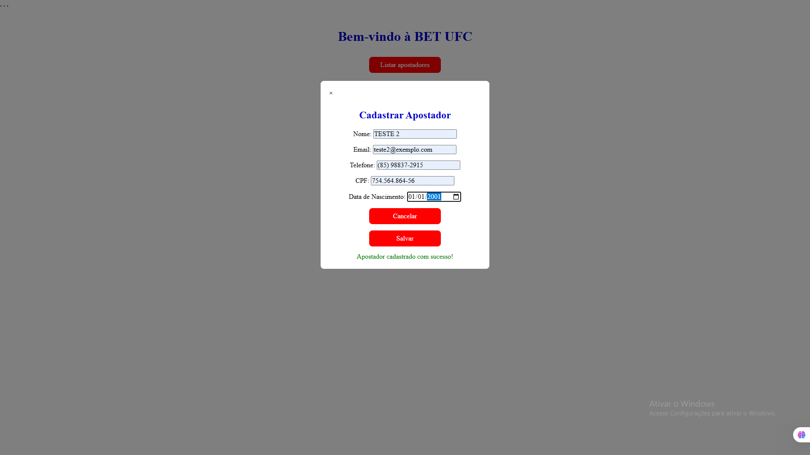
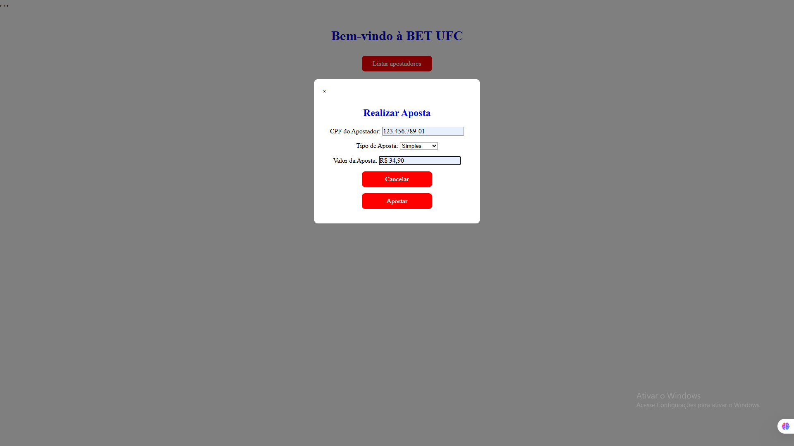
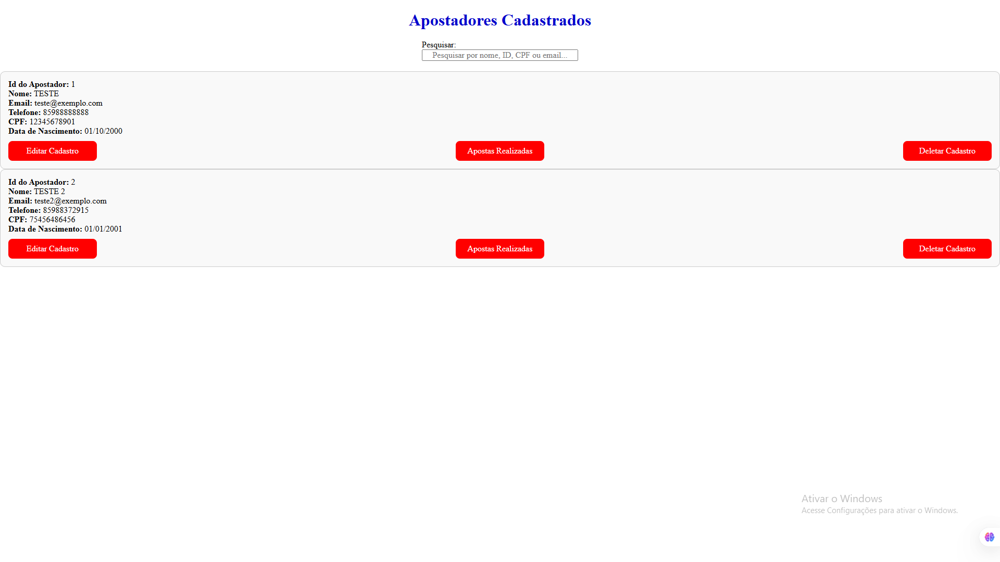
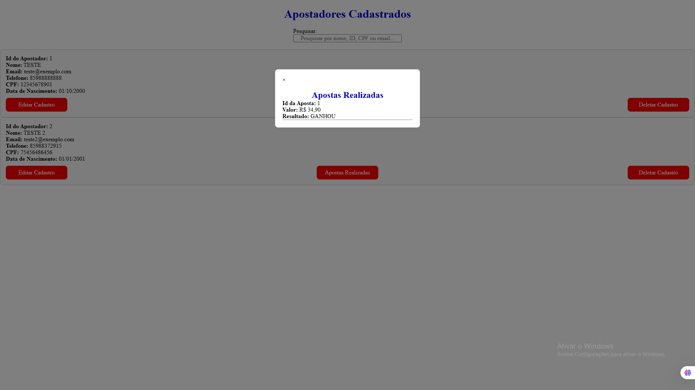
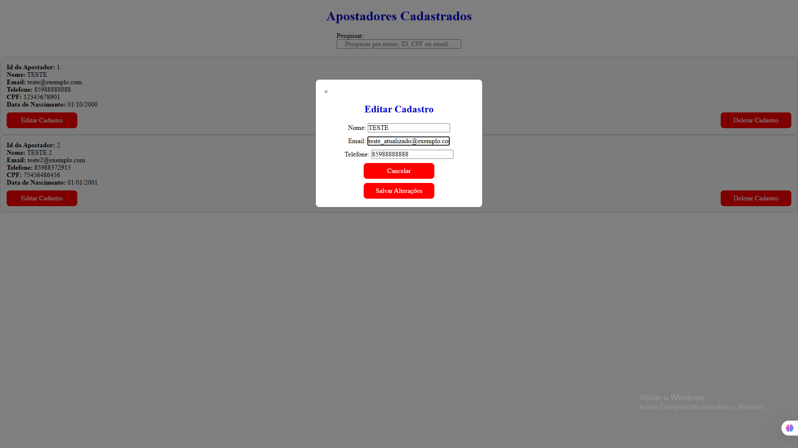
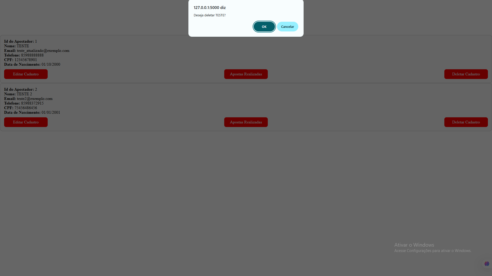

# BET UFC - Sistema de Apostas

Sistema web para gerenciamento de apostadores e apostas esportivas, permitindo:

- Cadastro, edição e remoção de apostadores
- Registro e listagem de apostas
- Consumo de API REST via JavaScript
- Integração frontend-backend utilizando Fetch API
- Testes automatizados com Pytest
- Persistência de dados utilizando SQLite

O projeto foi desenvolvido com foco em organização de código e uso de API REST.

---

## Licença

Este projeto foi desenvolvido para fins educacionais e de processo seletivo.

---

## Sumário

- [Tecnologias utilizadas](#tecnologias-utilizadas)
- [Como rodar o projeto](#como-rodar-o-projeto)
- [Arquitetura](#arquitetura)
- [Modelos](#modelos)
- [Rotas](#rotas)
- [Testes automatizados](#testes-automatizados)
- [Validações implementadas](#validações-implementadas)
- [Screenshots](#screenshots)

---

## Tecnologias utilizadas

- **Python** - Linguagem principal utilizada na construção da API
- **Flask** - Framework utilizado para desenvolvimento da API
- **SQLAlchemy** - ORM responsável pela modelagem e manipulação do banco de dados
- **SQLite** - SGBD utilizado para persistência dos dados
- **HTML / CSS / JavaScript** - Tecnologias utilizadas na construção da interface
- **Pytest** - Biblioteca utilizada para testes automatizados

---

## Como rodar o projeto

### 1. Clonando o repositório

No seu prompt de comando ou terminal do seu editor de código, rode:

```bash
git init
git clone https://github.com/victorsnr/Projeto_CEOS.git
cd Projeto_CEOS
```

(**Nota: é necessário ter o Git instalado**)

### 2. Criando um ambiente virtual Python:

Dentro do diretório clonado:

```bash
python -m venv venv
```

Para ativar, se sua máquina for Windows:

```bash
venv\Scripts\activate
```

Se for Linux:

```bash
source venv/bin/activate
```

#### Possível erro ao ativar o ambiente virtual no Windows (PowerShell)

Caso o PowerShell bloqueie a execução do ambiente virtual, execute:

```powershell
Set-ExecutionPolicy -Scope Process -ExecutionPolicy RemoteSigned
```

Depois disso, tente ativar o ambiente novamente:

```powershell
venv\Scripts\activate
```

### 3. Instalando bibliotecas:

Para instalar as bibliotecas do projeto:

```bash
pip install -r requirements.txt
```

### 4. Inicializando a aplicação

Para inicializar o servidor:

```bash
python app.py
```

Uma vez que o servidor esteja rodando, o site estará disponível em: http://127.0.0.1:5000

---

## Arquitetura

```plaintext
├─ instance/                            # Pasta que guarda o arquivo do banco de dados (o arquivo database.db é criado automaticamente ao inicializar a aplicação)
├─ routes/                              # Pasta de rotas geral
|   ├─ api.py                           # Arquivo de rotas e funções da API
|   └─ web.py                           # Arquivo de rotas web
├─ static/                              # Arquivos para estilização e integração interface-API
|   ├─ css/                             # Arquivos de estilização
|   |   ├─ cadastrar_apostador.css
|   |   ├─ editar_cadastro.css
|   |   ├─ exibir_apostadores.css
|   |   ├─ fazer_aposta.css
|   |   ├─ home.css
|   |   ├─ listar_apostas.css
|   |   └─ reset.css
|   ├─ js/                              # Scripts JavaScript responsáveis pela integração frontend-backend
|   |   ├─ busca_apostadores.js
|   |   ├─ cadastrar_apostador.js
|   |   ├─ deletar_apostador.js
|   |   ├─ editar_cadastro.js
|   |   ├─ fazer_aposta.js
|   |   └─ listar_apostas.js
├─ templates/                           # Arquivos para construção da interface
|   ├─ cadastrar_apostador.html
|   ├─ editar_cadastro.html
|   ├─ exibir_apostadores.html
|   ├─ fazer_aposta.html
|   ├─ home.html
|   └─ listar_apostas.html
├─ app.py                               # Arquivo principal da aplicação
├─ config.py                            # Arquivo de configurações gerais do projeto
├─ extensions.py                         # Arquivo para inicialização do SQLAlchemy
├─ models.py                            # Arquivo de modelos do banco de dados
├─ README.md                            # README
├─ requirements.txt                     # Arquivo de bibliotecas necessárias no funcionamento do projeto
└─ test_api.py                          # Arquivo de teste automatizado
```

## Modelos

### Apostador

| Campo    | Tipo                  | Descrição                       |
| -------- | --------------------- | ------------------------------- |
| id       | Integer (PRIMARY KEY) | Gerado automaticamente          |
| nome     | String[100]           | Nome do apostador               |
| email    | String[100]           | Email do apostador              |
| telefone | String[20]            | Telefone do apostador           |
| cpf      | String[11]            | CPF do apostador                |
| dt_nasc  | Date                  | Data de nascimento do apostador |

### Aposta

| Campo        | Tipo                  | Descrição                                                                                                  |
| ------------ | --------------------- | ---------------------------------------------------------------------------------------------------------- |
| id           | Integer (PRIMARY KEY) | Gerado automaticamente                                                                                     |
| apostador_id | Integer (FOREIGN KEY) | Id do apostador que realizou a aposta                                                                      |
| tipo_aposta  | String[50]            | Tipo da aposta (fazendo a requisição pelo navegador, possui tipos específicos)                             |
| valor        | Float                 | Valor apostado                                                                                             |
| resultado    | String[20]            | Resultado da aposta (gerado automaticamente e de forma aleatória se a requisição for feita pelo navegador) |

---

## Rotas

A aplicação possui duas categorias de rotas: as rotas web (responsáveis pela interface da aplicação) e as rotas da API.

### Rotas web

| Método | Rota                  | Descrição                                                                                           | Links (após servidor inicializado)       |
| ------ | --------------------- | --------------------------------------------------------------------------------------------------- | ---------------------------------------- |
| GET    | `/`                   | Página inicial. Armazena as funções "Listar apostadores", "Cadastrar apostador" e "Realizar aposta" | http://127.0.0.1:5000/                   |
| GET    | `/exibir_apostadores` | Lista de todos os apostadores presentes no banco de dados                                           | http://127.0.0.1:5000/exibir_apostadores |

### Rotas API

#### 1. Rotas Apostador

| Método | Rota                         | Descrição                                                            | Exemplos                                         |
| ------ | ---------------------------- | -------------------------------------------------------------------- | ------------------------------------------------ |
| GET    | `/api/obter_cadastro/<id>`   | Retorna os dados de um apostador com determinado id existente        | [Ir para exemplo](#get-apiobter_cadastroid)      |
| GET    | `/api/exibir_apostadores`    | Retorna os dados de todos os apostadores presentes no banco de dados | [Ir para exemplo](#get-apiexibir_apostadores)    |
| POST   | `/api/cadastrar_apostador`   | Cadastra (adiciona ao banco de dados) uma apostador                  | [Ir para exemplo](#post-apicadastrar_apostador)  |
| PUT    | `/api/editar_cadastro/<id>`  | Edita os dados de um apostador com determinado id existente          | [Ir para exemplo](#put-apieditar_cadastroid)     |
| DELETE | `/api/deletar_cadastro/<id>` | Deleta os dados de um apostador com determinado id existente         | [Ir para exemplo](#delete-apideletar_cadastroid) |

#### 2. Rotas Apostas

| Método | Rota                     | Descrição                                                       | Exemplo                                     |
| ------ | ------------------------ | --------------------------------------------------------------- | ------------------------------------------- |
| GET    | /api/exibir_apostas/<id> | Retorna os dados das apostas do apostador com o id especificado | [Ir para exemplo](#get-apiexibir_apostasid) |
| POST   | /api/apostar             | Cria (adiciona um elemento ao banco de dados) uma aposta        | [Ir para exemplo](#post-apiapostar)         |

---

### Exemplos para as rotas

#### `GET /api/obter_cadastro/<id>`

Recebe o id de um apostador e procura esse id no banco de dados.  
Caso o apostador exista, retorna seus dados em formato JSON com código HTTP `200 OK`.

Exemplo de resposta:

```json
{
  "id": 1,
  "nome": "JOÃO SILVA",
  "email": "joao@exemplo.com",
  "telefone": "85999999999",
  "cpf": "12345678910",
  "dt_nasc": "1999-01-01"
}
```

#### `GET /api/exibir_apostadores`

Retorna uma lista contendo todos os apostadores cadastrados no banco de dados, com código HTTP 200 OK.

Exemplo de resposta:

```json
[
  {
    "id": 1,
    "nome": "JOÃO SILVA",
    "email": "joao@exemplo.com",
    "telefone": "85999999999",
    "cpf": "12345678910",
    "dt_nasc": "1999-01-01"
  },
  {
    "id": 2,
    "nome": "MARIA SOUZA",
    "email": "maria@exemplo.com",
    "telefone": "85988888888",
    "cpf": "23456789012",
    "dt_nasc": "2000-05-10"
  }
]
```

#### `POST /api/cadastrar_apostador`

Cria um novo apostador no banco de dados.
A rota recebe um JSON com os dados do apostador e realiza validações.

Caso algum dado seja inválido, retorna erro `400 Bad Request`.
Caso o cadastro seja realizado com sucesso, retorna código `201 Created`.

Exemplo de requisição:

```json
{
  "nome": "JOÃO SILVA",
  "email": "joao@exemplo.com",
  "telefone": "85999999999",
  "cpf": "12345678910",
  "dt_nasc": "1999-01-01"
}
```

Exemplo de resposta:

```json
{
  "message": "Apostador cadastrado",
  "id": 1
}
```

#### `PUT /api/editar_cadastro/<id>`

Atualiza o nome, email e telefone de um apostador existente.
Recebe um JSON com os novos dados e retorna um código HTTP `200 OK` em caso de sucesso.

Exemplo de requisição:

```json
{
  "nome": "JOÃO SILVA ATUALIZADO",
  "email": "joao_atualizado@exemplo.com",
  "telefone": "85988888888"
}
```

Exemplo de resposta:

```json
{
  "message": "Apostador atualizado"
}
```

#### `DELETE /api/deletar_cadastro/<id>`

Remove um apostador do banco de dados, assim como as apostas atreladas ao seu id através de cascade delete.
Retorna um código HTTP `200 OK` caso haja sucesso.

Exemplo de resposta:

```json
{
  "message": "Apostador deletado"
}
```

#### `GET /api/exibir_apostas/<id>`

Retorna todas as apostas associadas ao apostador informado.
Retorna um código HTTP `200 OK` caso haja sucesso.

Exemplo de resposta:

```json
[
  {
    "id": 1,
    "tipo_aposta": "simples",
    "valor": 100.0,
    "resultado": "GANHOU"
  },
  {
    "id": 2,
    "tipo_aposta": "multipla",
    "valor": 50.0,
    "resultado": "PERDEU"
  }
]
```

#### `POST /api/apostar`

Cria uma nova aposta associada a um apostador existente.
Retorna um código HTTP `201 Created` caso haja sucesso.

Exemplo de requisição:

```json
{
  "cpf": "12345678901",
  "tipo_aposta": "simples",
  "valor": 20.0,
  "resultado": "GANHOU"
}
```

Exemplo de resposta:

```json
{
  "message": "Aposta realizada"
}
```

---

## Testes automatizados

O projeto possui testes automatizados utilizando a biblioteca **Pytest** e banco de dados SQLite em memória (`sqlite:///:memory:`), garantindo isolamento entre execuções e maior velocidade nos testes.

Os testes verificam:

- Cadastro de apostador
- Busca de apostador
- Edição de cadastro
- Exclusão de apostador
- Criação de apostas
- Listagem de apostas

### Executando os testes

Com o ambiente virtual ativado, execute:

```bash
pytest -v
```

Para exibir também os logs das requisições no terminal:

```bash
pytest -s -v
```

Exemplo de saída no terminal:

```plaintext
POST /api/cadastrar_apostador - Status Code: 201
GET /api/obter_apostador/1 - Status Code: 200
POST /api/apostar - Status Code: 201
GET /api/exibir_apostas/1 - Status Code: 200
POST /api/apostar - Status Code: 201
PUT /api/editar_cadastro/1 - Status Code: 200
GET /api/exibir_apostadores - Status Code: 200
DELETE /api/deletar_cadastro/1 - Status Code: 200
```

---

## Validações implementadas

A aplicação realiza validações tanto no frontend quanto no backend, incluindo:

- Nome não pode conter dígitos
- CPF com exatamente 11 dígitos
- Telefone com 10 ou 11 dígitos
- Verificação de maioridade (18+)
- Datas de nascimento futuras (exemplo: "dt-nasc": "2070-02-01")
- CPF e email duplicado
- Valor de aposta maior que zero
- Existência do apostador antes da criação da aposta

## Screenshots








